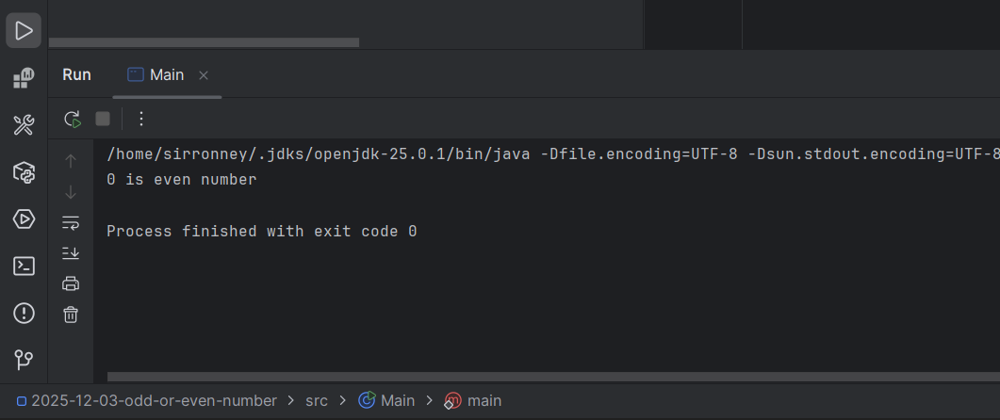

**Problem**: Write a Java program that checks whether a given number is odd or even.

Before we even begin anything. Is Zero (0) an odd or even number? 

Ever wondered about that? Zero is not an odd number; it is an even number.

An even number is defined as any integer that is exactly divisible by \(2\) with no remainder, and since (0/2=0), it fits this definition. Conversely, By algebraic form: An odd number can be expressed as \(2n+1\) and there is no integer \(n\) that can make \(2n+1\) equal to \(0\). 

Aah, now that we have that cleared up, let's move on to the solution.

## Solution

Here's my solution to check whether a number is odd or even:

```java
public class Main {
    public static void main(String[] args){
        int n = 0;

        if(n % 2 == 0){
            System.out.println(n + "is even number");
        }else {
            System.out.println(n + "is odd number");
        }
    }
}
```

**Output:**

```0 is even number
```


This program uses the modulus operator (`%`) to determine if there is a remainder when `n` is divided by `2`. If there is no remainder, the number is even; otherwise, it is odd.

This code can be found in my [gitHub](https://github.com/0tieno/BlogCode/tree/main/2025-12-03-odd-or-even-number)

Happy hacking!