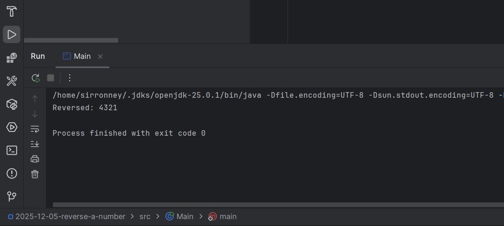

**Problem**: Write a Java program that reverses a given integer number.

This challenge got me to start slowing down when I want to think well through a problem. That's always a good thing!

Here is my solution:

```java
public class Main {
    public static void main(String[] args) {
        int num = 1234;
        int reversed = 0;

        while (num != 0) {
            int digit = num % 10;
            reversed = reversed * 10 + digit;
            num /= 10;
        }
        System.out.println("Reversed: " + reversed);
    }


}


```
**Output:**
```Reversed: 4321
```


## Explanation

The above code looks pretty straightforward, but let's break it down in simple terms like I always like it!

You have a number: `1234` You want to turn it into:`4321` But you're not allowed to convert it to a string. You must do it mathematically.

Think of the number like a stack of digits

Number = 1234

- Last digit = 4
- Then 3
- Then 2
- Then 1

We remove digits from the end one by one.

1. **Extract the Last Digit**: Use `num % 10` to get the last digit.
2. **Build the Reversed Number**: Multiply the current reversed number by 10 and add the extracted digit. Perhaps you are wondering why we are multiplying by 10? Continue reading! It is explained below this solution.
3. **Remove the Last Digit**: Use integer division `num /= 10` to drop the last digit from the original number.
4. **Repeat**: Continue until there are no digits left (`num` becomes 0). Here is where we use the while loop.

### Why Multiply by 10?

When building the reversed number, multiplying by 10 shifts the digits to the left, making space for the new digit at the end.

For example:
- Start with `reversed = 0`
- Add digit `4`: `reversed = 0 * 10 + 4 = 4`
- Next digit `3`: `reversed = 4 * 10 + 3 = 43`
- Next digit `2`: `reversed = 43 * 10 + 2 = 432`
- Last digit `1`: `reversed = 432 * 10 + 1 = 4321`
- Final Output: `4321`

In case we did it this way it would be wrong:
- Start with `reversed = 0`
- Add digit `4`: `reversed = 0 + 4 = 4`
- Next digit `3`: `reversed = 4 + 3 = 7`
- Next digit `2`: `reversed = 7 + 2 = 9`
- Last digit `1`: `reversed = 9 + 1 = 10`
- Final Output: `10` (which is incorrect)


### General Rules for Reversing a Number

> Every time you want to add a new digit at the end of a number, you must multiply the old number by 10.

| Old | Add Digit | Multiply by 10 | Final |
| --- | --------- | -------------- | ----- |
| 4   | 3         | 4*10 = 40      | 43    |
| 43  | 2         | 43*10 = 430    | 432   |
| 432 | 1         | 432*10 = 4320  | 4321  |

This is exactly what the code is doing.

This code can be found in my [github](https://github.com/0tieno/BlogCode/tree/main/2025-12-05-reverse-a-number).

Happy hacking!