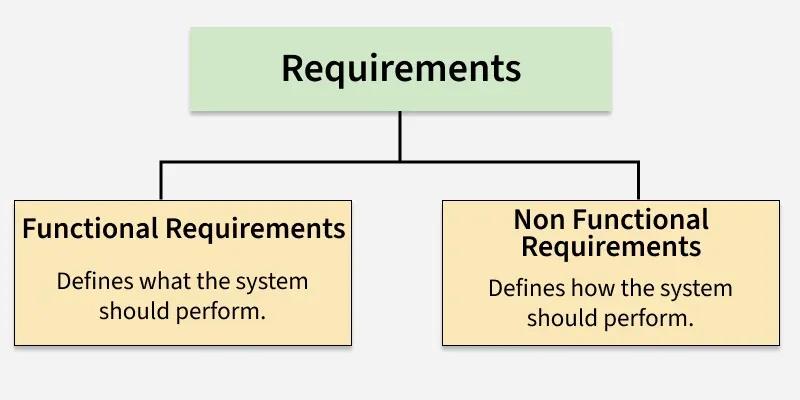

Given a software problem or project, one of the first steps in the development process is to gather and define the requirements well before implementation. Again I repeat our this series mantra: `nothing beats working on the right thing`. 

In software architecting and engineering, requirements are typically categorized into two main types: functional requirements and non-functional requirements. Understanding the distinction between these two types is crucial for effective system design and development.

**Functional Requirements:**

Functional requirements answer the question of "what" the system should do. They define the specific behaviors, functions, and features that the system must provide to meet the needs of its users. Examples of functional requirements include:

1. User authentication and authorization.
2. Data input and validation.
3. Business logic and processing.

**Non-Functional Requirements:**

Non-functional requirements, on the other hand, answer the question of "how" the system performs its functions. They define the quality attributes, constraints, and standards that the system must adhere to. Examples of non-functional requirements include:

1. Performance: The system should respond to user requests within 2 seconds.
2. Scalability: The system should handle a growing number of users without performance degradation.
3. Security: The system should protect user data through encryption and secure access controls.
4. Usability: The system should have an intuitive user interface that is easy to navigate.

When gathering requirements, it is important to involve stakeholders, including end-users, business analysts, and developers, to ensure that all relevant requirements are captured and understood. Clear documentation of both functional and non-functional requirements is crucial for guiding the design, development, and testing phases of the software development lifecycle.

In the light of this subject, just pause a moment and look at your body architecture! Appreciate the `Chief Architect`!

Happy architecting!