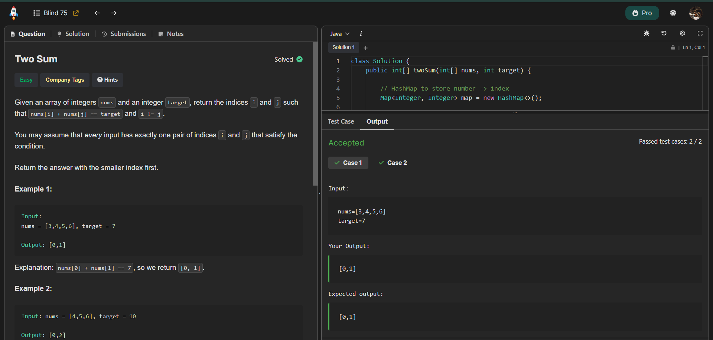

Honestly somehow, this is my first ever intentional attempt at a DSA problem in my entire life. And I cant explain anything! I'm in awe!

The Two Sum problem is a classic coding challenge that tests your understanding of arrays and hash maps. The goal is to find two numbers in an array that add up to a specific target.



Here's my solution using a hash map for efficient look-up:

```java
import java.util.HashMap;
import java.util.Map;

class Solution {
    public int[] twoSum(int[] nums, int target) {

        // HashMap to store number -> index
        Map<Integer, Integer> map = new HashMap<>();

        // Iterate through the array
        for (int i = 0; i < nums.length; i++) {

            int current = nums[i];
            int difference = target - current;

            // Check if we have seen the required difference before
            if (map.containsKey(difference)) {
                // Return indices in correct order
                return new int[]{map.get(difference), i};
            }

            // Store current number and its index
            map.put(current, i);
        }

        // This line will never be reached (problem guarantees one solution)
        return new int[]{};
    }
}
```

This solution works by iterating through the array and using a hash map to keep track of the numbers we've seen so far and their indices. For each number, we calculate the difference needed to reach the target and check if that difference is already in the map. If it is, we return the indices of the two numbers.

This approach has a time complexity of O(n) since we only traverse the array once, and the space complexity is also O(n) due to the additional storage used by the hash map.

Happy hacking!