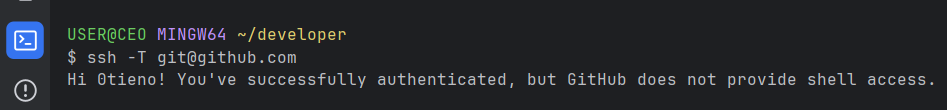

If you use Git, you’ve probably encountered this frustrating error message at some point:


This error usually means that Git can’t find your SSH key or the key isn’t properly configured with your Git hosting service (like GitHub, GitLab, etc.).

The solution is to generate a new SSH key and add it to your Git account. Here’s my simple solution step-by-step:

## Step 1: Check if you already have an SSH key

Before generating a new key, check if you already have one:

```bash
ls -al ~/.ssh
```

If you see files like: `id_ed25519` `id_ed25519.pub` or `id_rsa` `id_rsa.pub`, you already have an SSH key. You can skip to Step 3.

If not, continue.
## Step 2: Generate a new SSH key

Run the following command to generate a new SSH key (using Ed25519 algorithm):

```bash
ssh-keygen -t ed25519 -C "your-email@example.com"
```

Press Enter for all prompts.

## Step 3: Add SSH key to GitHub

Copy your public key:

```bash
cat ~/.ssh/id_ed25519.pub
```

Now:

1. Go to GitHub → Settings
2. SSH and GPG keys
3. New SSH key
4. Paste the key and save.

## Step 4: Test the connection

Run this command to test:

```bash
ssh -T git@github.com
```

You should see:
```
Hi USERNAME! You've successfully authenticated...
```


If you see that, you’re all set!

This is a future note to myself and anyone else who runs into this issue. 

Happy learning!