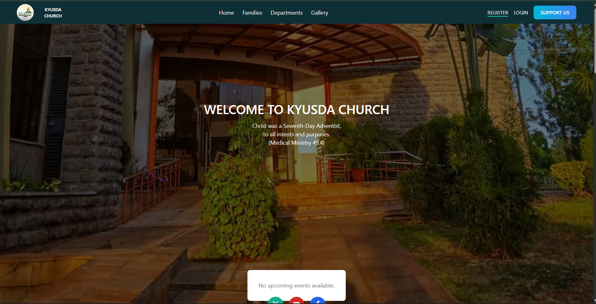

Ever wondered what happens behind the scenes when you type a URL into your browser and hit Enter? Let’s take a deep dive into the journey of a request to a sample site https://www.kyusda.org/.

## Step 1: URL Parsing and DNS Lookup

When you hit Enter on https://www.kyusda.org/:


Your browser parses the URL:

1. Scheme: https → tells the browser to use HTTP over TLS/SSL.
2. Host: www.kyusda.org → the domain it needs to contact.
3. Path: / → the root path on the server.

Browser checks its cache for DNS (Domain Name System) info to resolve www.kyusda.org into an IP address. If not cached, it queries your configured DNS server to find the server’s IP, essentially asking: `“Hey, where is this site on the internet?”`

## Step 2: TCP Connection

Once the IP is known, the browser starts a TCP handshake with the server:

1. SYN: Browser says “Hello, I want to talk.”
2. SYN-ACK: Server replies, “Hello, I hear you. Ready?”
3. ACK: Browser acknowledges, “Great, let’s talk.”

This establishes a reliable channel for communication.

## Step 3: TLS Handshake (Because HTTPS)

Because the URL is HTTPS, a TLS handshake occurs next:

They agree on encryption protocols.

The server proves its identity with an SSL certificate.

Keys are exchanged securely.

From this point forward, all data is encrypted, protecting your connection from eavesdroppers :)

## Step 4: HTTP Request

Now the browser sends an HTTP GET request:

```bash
    GET / HTTP/1.1
    Host: www.kyusda.org
    User-Agent: [browser info]
    Accept: text/html, ...
```

This is basically saying: “Server, give me the homepage HTML.”

## Step 5: Server Processing

On the backend, the server (probably running something like Apache, Nginx, or a cloud hosting stack) receives the request:

It may check logs, authentication, or firewall rules.

If it’s dynamic, it might query a database.

Finally, it generates a response — often HTML, CSS, and maybe some initial JavaScript.

For KYUSDA’s site, the response is likely mostly static HTML with linked assets (images, CSS, JS).

## Step 6: HTTP Response

The server sends back an HTTP response:

```bash
    HTTP/1.1 200 OK
    Content-Type: text/html
    Content-Length: 10456
```

…and then streams the HTML content.

If there’s a redirect (like forcing HTTPS or a www vs non-www preference), you might first see a 301 or 302 response and then another round-trip to the correct URL.

## Step 7: Rendering

The browser parses the HTML, building the DOM tree:

CSS is fetched and applied.

JavaScript is executed.

Images and other assets are loaded asynchronously.

Finally, the fully-rendered webpage appears in your browser.



## Step 8: Additional Background Chatter

Even after the page loads, the browser might:

- Fetch analytics scripts.
- Preload fonts or images.
- Maintain WebSocket connections if needed.
- Cache assets for faster future loads.

In short: that simple “Enter” press triggers a ballet of DNS lookups, TCP and TLS handshakes, HTTP requests, server processing, and finally, browser rendering. Each step is crucial — one tiny misstep, and the page won’t load.

This is an oversimplified overview for sure! Perhaps in the next we will dive deeper into the journey of a request. For example what actually happens when I click "Send Money."

Happy hacking!