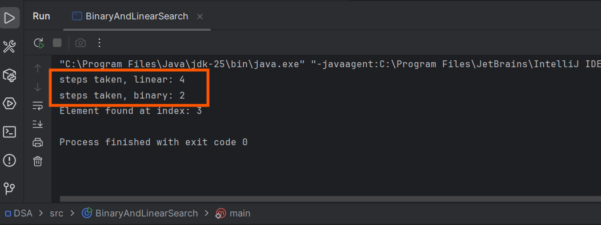

This post is an intro to a series of dsa concepts revised.

First of all, we Often we talk about time complexity and space complexity of algorithms. `Time complexity` is a way to describe how the runtime of an algorithm grows as the input size increases. `Space complexity`, on the other hand, describes how much memory an algorithm uses as the input size grows. 

In order to write efficient code, the above two concepts are very important. They help us understand how our code will perform as the input size increases, and they allow us to compare different algorithms to find the most efficient one for a given problem.

Now into binary and linear search algorithms, here is where the fun begins!
It dictates how we can search for an element in a collection of data.

## binary search

Binary search is a fast search algorithm that works on sorted arrays. It repeatedly divides the search interval in half until the target value is found or the interval is empty.

## linear search

Linear search is a simple search algorithm that checks each element in the array one by one until it finds the target value or reaches the end of the array. Works on both sorted and unsorted arrays, but is slower than binary search for large datasets.

## linear vs binary search
- Binary search is much faster than linear search for large sorted datasets, with a time complexity of O(log n) compared to O(n) for linear search. However, binary search requires the array to be sorted beforehand, while linear search can work on unsorted arrays. For small datasets or when the array is unsorted, linear search may be more efficient due to its simplicity and lower overhead.


```

        // This class demonstrates two search algorithms: Linear Search and Binary Search
    public class BinaryAndLinearSearch {

        static void main() {

            /*
                TIME COMPLEXITY EXPLANATION:
                - Time complexity measures how the running time grows as input size increases
                - Binary search: O(log n) - Very fast! Cuts the search space in half each time
                - Linear search: O(n) - Slower, checks every element one by one
            */

            // Our sorted array of numbers to search through
            int[] nums = {5,7,9,11,13};

            // The number we're looking for
            int target = 11;

            // LINEAR SEARCH: Check each element one by one until we find the target
            int result1 = linearSearch(nums, target);

            // BINARY SEARCH: Smart search that splits the array in half repeatedly
            int result = binarySearch(nums, target);

            // Display the result - either the index where we found it, or "not found"
            if (result != -1){
                System.out.println("Element found at index: " + result);
            }else{
                System.out.println("Element Not found");
            }
        }

        /**
         * LINEAR SEARCH - The simple approach
         * Think of it like: Looking through a book page by page until you find what you want
         * Works on any array (sorted or unsorted)
         */
        public static int linearSearch(int[] nums, int target) {
            int steps = 0; // Counter to see how many checks we make

            // Loop through every element in the array
            for (int i = 0; i < nums.length; i++) {
                steps++; // Count each check

                // If we found the target, return its position
                if (nums[i] == target){
                    System.out.println("steps taken, linear: " + steps);
                    return i; // Return the index where we found it
                }
            }

            // If we get here, the target wasn't in the array
            return -1;
        }

        /**
         * BINARY SEARCH - The smart approach
         * Think of it like: Opening a dictionary in the middle, then deciding if you need
         * to go left or right, then repeating until you find the word
         * IMPORTANT: Only works on SORTED arrays!
         */
        public static int binarySearch(int[] nums, int target) {
            // Example array: {5,7,9,11,13}

            // Set up our search boundaries
            int left = 0;                  // Start of array (index 0)
            int right = nums.length - 1;   // End of array (index 4 in our example)

            int steps = 0; // Counter to see how many checks we make

            // Keep searching while we still have elements to check
            while(left <= right){
                // Find the middle element between left and right
                int mid = (left + right) / 2;
                steps++;

                // Check if the middle element is what we're looking for
                if (nums[mid] == target){
                    System.out.println("steps taken, binary: " + steps);
                    return mid; // Found it! Return its index

                // If middle element is too small, search the RIGHT half
                } else if (nums[mid] < target) {
                    left = mid + 1; // Ignore left half, move left pointer up

                // If middle element is too large, search the LEFT half
                } else {
                    right = mid - 1; // Ignore right half, move right pointer down
                }
            }

            // If we get here, the target wasn't in the array
            return -1;
        }
    }

```




This code can be found [here](https://github.com/0tieno/BlogCode/blob/main/DSA/src/BinaryAndLinearSearch.java).

Happy hacking!


