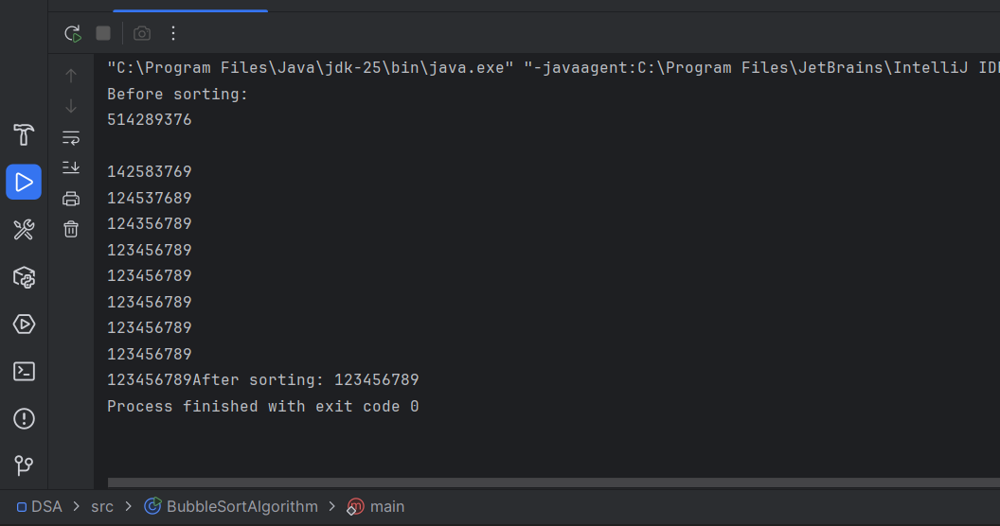

Bubble Sort is a simple sorting algorithm that repeatedly compares adjacent elements in an array and swaps them if they are in the wrong order. This process continues until the array is sorted. It is not efficient for large datasets due to its high time complexity of O(n^2), but it is easy to understand and implement.

Below is a sample implemetation:

```
    public class BubbleSortAlgorithm {

    /**
     * Bubble sort Algorithm
     */

    static void main() {

    int [] nums = {5, 1, 4, 2, 8, 9, 3, 7, 6};
    int size = nums.length;
    int temp =0;

        System.out.println("Before sorting: ");
        for (int num:nums){
            System.out.print(num);
        }

        System.out.println();

        // Outer loop for passes
        for (int i = 0; i < size; i++) {

            // Inner loop for comparing adjacent elements
            for (int j = 0; j < size-i-1; j++) {

                // Swap elements if they are in the wrong order
                if (nums[j] >  nums[j+1]){
                    temp = nums[j];
                    nums[j] = nums[j+1];
                    nums[j+1]= temp;
                }
            }
            System.out.println();
            for (int num:nums){
                System.out.print(num);
            }
        }

        System.out.print("After sorting: ");
        for (int num:nums){
            System.out.print(num);
        }
    }


}

```




This code can be found [here]()

Happy hacking!