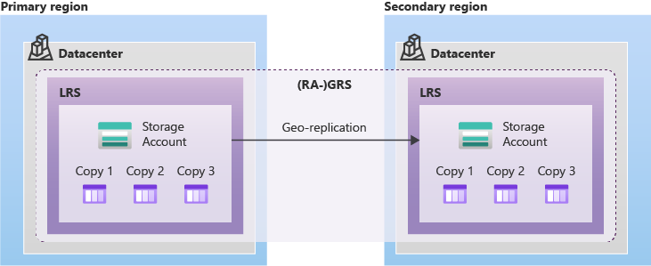

I was a victim of the [Iranian drone strikes that hit three AWS data centers in the UAE and Bahrain targeting Amazon cloud infrastructure](https://www.tomshardware.com/tech-industry/drone-strikes-hit-three-aws-data-centers-in-the-uae-and-bahrain) affecting my databases in MongoDB Atlas. I lost production data and I haven't been able to recover it to date. It hit me hard and I stopped ignoring to also design for availability and safety in my applications.

Sometimes bad things happen. Like planned or unplanned downtime, hardware failures, or even natural disasters. When these things happen, how do you ensure that your data is safe and is still available? That's the all point of **data redundancy**.

Data redundancy is the process of storing the same data in multiple locations to ensure that it is always available, even in the event of a failure.

As we discussed [yesterday](/Blog/Design Data Storage Solution for Non-Relational Data), we have 4 options for storing **non-relational data** in [Microsoft Azure](https://azure.microsoft.com/) and here is how we can achieve data redundancy for our stored data:

### 1. Azure Storage Redundancy Options

Azure provides several options for data redundancy, each with its own benefits and trade-offs. The most common options are:

- **Locally Redundant Storage (LRS)**: This option stores three copies of your data within a single data center. It is the most cost-effective option, but it does not protect against data center failures.

- **Zone-Redundant Storage (ZRS)**: This option stores three copies of your data across multiple data centers within a single region. It provides better protection against data center failures, but it is more expensive than LRS.

- **Geo-Redundant Storage (GRS)**: This option stores six copies of your data across two regions, with three copies in the primary region and three copies in the secondary region. It provides the highest level of protection against data center failures, but it is the most expensive option.

### 2. Choosing the Right Redundancy Option

When choosing a redundancy option, you need to consider your business requirements and budget. If you have a small business with limited resources, LRS may be the best option for you. If you have a larger business with more critical data, ZRS or GRS may be a better choice.

### TLDR

Always design for failure as if it has happened. We can always achieve this with data redundancy. And always note the possible trade offs redundancy comes with like latency, cost, complexity, management, inconsistency etc.

Happy hacking!

